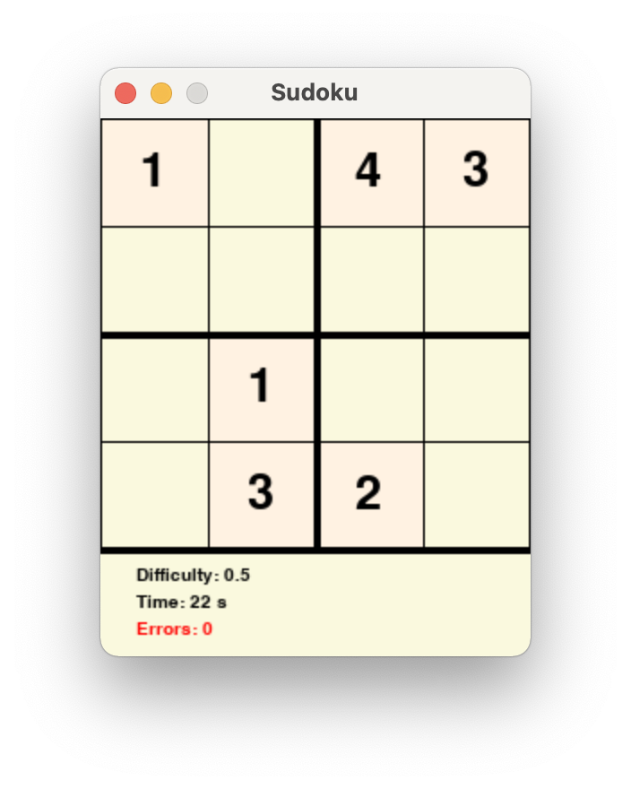
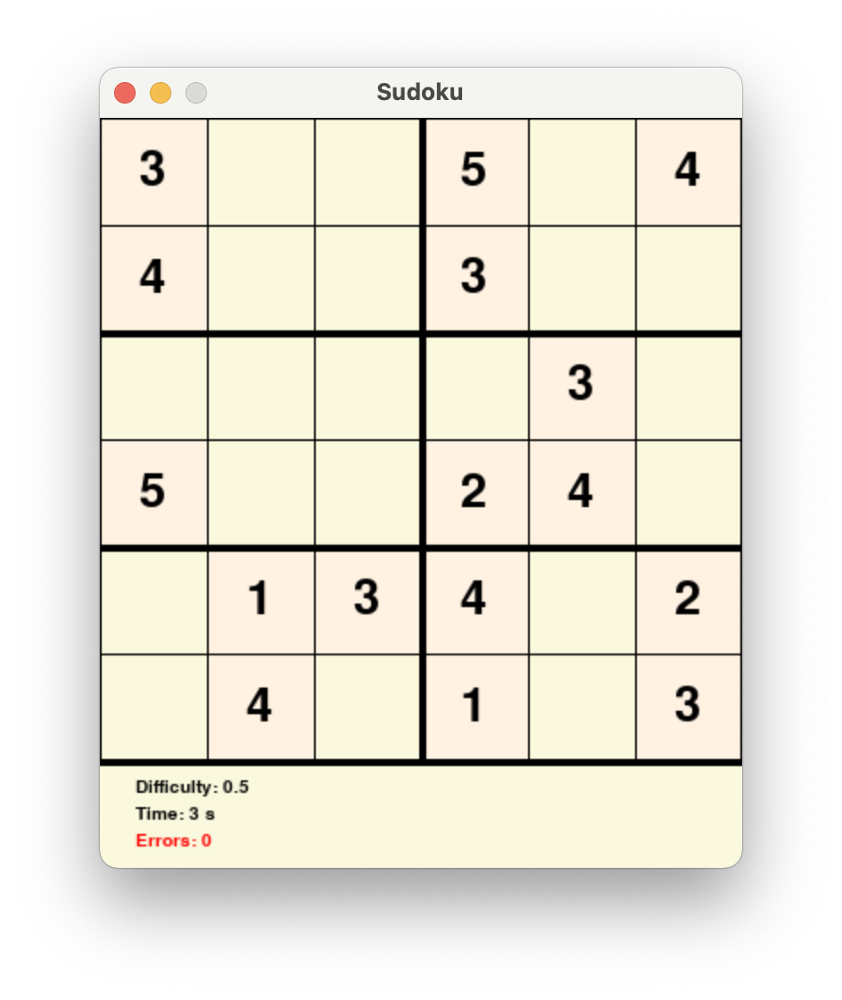
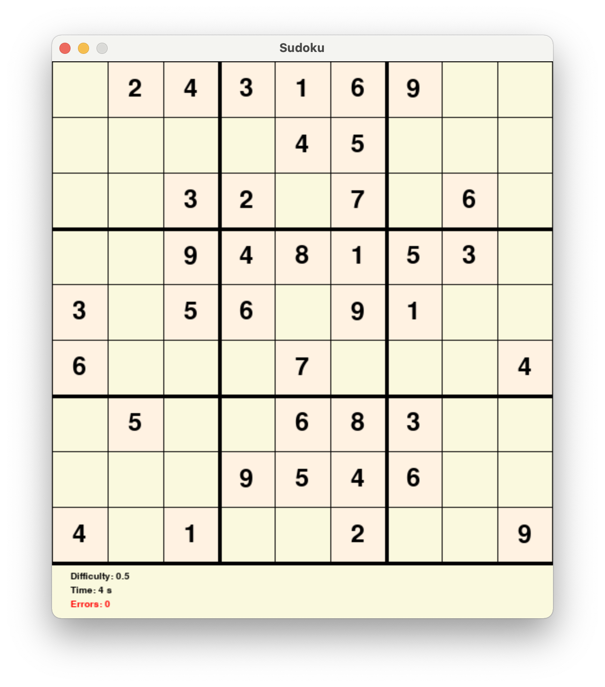

# Sudoku
 
### Let's play with Sudoku!!!  
PLAY with different `size`（4，6，9） and `difficulty`!
```bash
$ cd Sudoku
$ python main.py --size 6 --difficulty 0.6
```
### Play result with `size=6, difficulty=0.1`


### size=4


### size=6


### size=9


